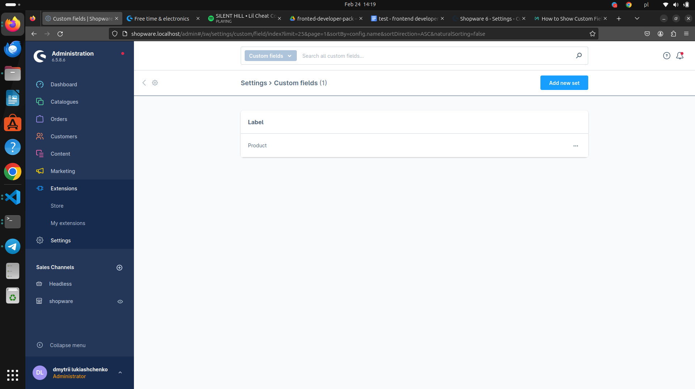
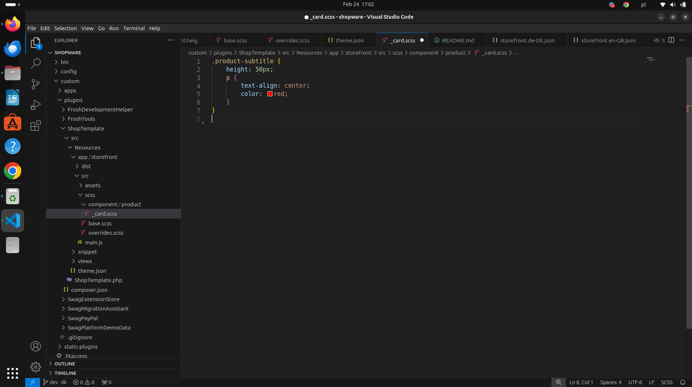

## Zadanie testowe dla stanowiska Junior Fronted Developer Shopware 6
## Spis treści
* [Zadania](#zadania)
* [Wykonanie](#wykonanie)
* [Problemy z wykonaniem](#problemy-z-wykonaniem)

## Zadania
* Utworz nowy szablon o nazwie ShopTemplate i dodaj do sklepu jakis produkt i kategorie (tak bys mogl zrobic zdanie od 2 do 4)
* Utworz dla produktu custom fields z panelu administracjengo (recznie)  https://docs.shopware.com/en/shopware-6-en/settings/custom-fields dodaj pole typu  text  o nazwie product_subtitle
* Nadpisz element twig w taki sposób aby dodać po tytułem produktu na stronie kategorii pojawił się następujący text (text ma się tylko pojawić jaki pole product_subtitle jest uzupelnione - zrob warunek IF) 
* Dodaj  plik less w którym sformatujesz ten element tak aby był wyśrodkowany i koloru czerwonego 
* W wersji mobilnej <480px subtytuł ma byc koloru zielonego 
* Do kompilacji less  wykorzystaj kommende (zroob screenshot i tutaj wklej ze jej uzyles) 

## Wykonanie
* Utworz nowy szablon o nazwie ShopTemplate i dodaj do sklepu jakis produkt i kategorie (tak bys mogl zrobic zdanie od 2 do 4)

* Utworz dla produktu custom fields z panelu administracjengo (recznie)  https://docs.shopware.com/en/shopware-6-en/settings/custom-fields dodaj pole typu  text  o nazwie product_subtitle

* Nadpisz element twig w taki sposób aby dodać po tytułem produktu na stronie kategorii pojawił się następujący text (text ma się tylko pojawić jaki pole product_subtitle jest uzupelnione - zrob warunek IF)

* Dodaj  plik less w którym sformatujesz ten element tak aby był wyśrodkowany i koloru czerwonego

* W wersji mobilnej <480px subtytuł ma byc koloru zielonego

* Do kompilacji less  wykorzystaj kommende (zroob screenshot i tutaj wklej ze jej uzyles)

## Problemy z wykonaniem
* Brak informacji na temat łączenia "less" z frameworkiem "Shopware 6"
